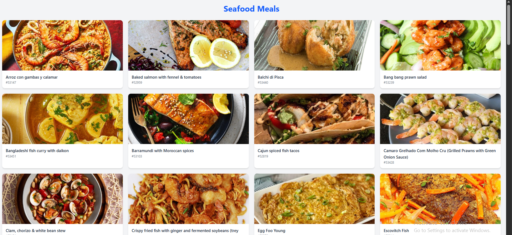
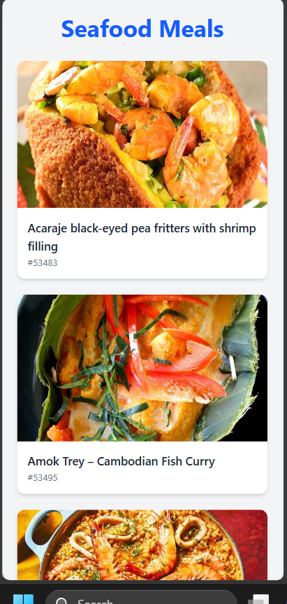

# Seafood Meals App

A responsive React application that fetches and displays seafood meals from TheMealDB API. This project demonstrates API integration, state management with React Hooks, and modern responsive styling using Tailwind CSS.

## 🔗 Live Demo

[View Live Application](https://meal-app-iota-bice.vercel.app/)

## Features

- Fetches seafood meal data from TheMealDB API
- Displays meal images, names, and IDs
- Responsive card-based layout
- Built with React Hooks (`useState` and `useEffect`)
- API requests handled with Axios
- Styled with Tailwind CSS
- Mobile-friendly design

## Technologies Used

- React
- Vite
- Axios
- Tailwind CSS
- JavaScript (ES6+)
- TheMealDB API


## API

This project uses data from TheMealDB API:

```text
https://www.themealdb.com/api/json/v1/1/filter.php?c=Seafood
```

## 📸 Screenshots

### Desktop View


### Mobile View


## 🚀 Getting Started

Clone the repository:

```bash
git clone https://github.com/olajideIfe/meal-app.git
```

Navigate to the project folder:

```bash
cd meal-app
```

Install dependencies:

```bash
npm install
```

Start the development server:

```bash
npm run dev
```

## What I Learned

- Fetching data from external APIs
- Using Axios for HTTP requests
- Managing state with React Hooks
- Working with useEffect for side effects
- Rendering dynamic data using map()
- Building responsive layouts with Tailwind CSS

## Future Improvements

- Add search functionality
- Add meal detail pages
- Implement React Router
- Add loading indicators
- Improve error handling
- Add category filtering
- Add favorite meals feature

## Author

Created by Ifedolapo Olajide.
